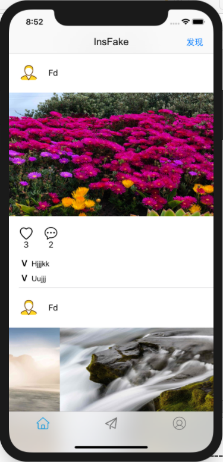
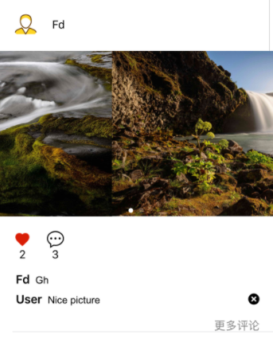
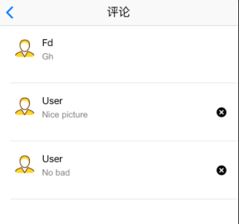
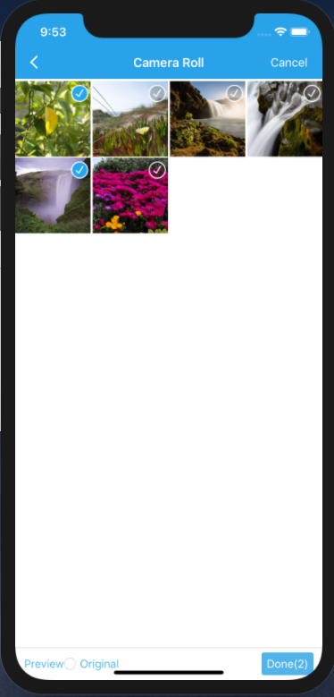
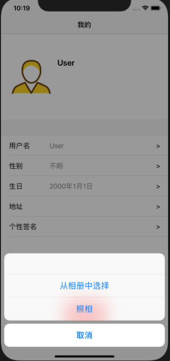
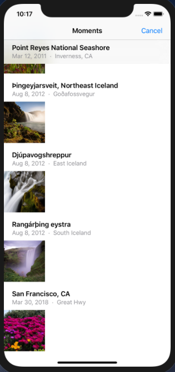
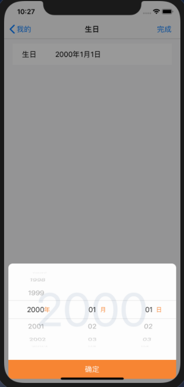

# InsFake使用手册

**版本：v1.0  开发人员：朱龙威  左杰文  周建华**

[TOC]

## 1.登录和注册
### 1.1登录
>首次登入InsFake进入如下登录界面。已有账号的用户可以输入用户名和密码进行登录。
登录成功后将自动跳转至主页。再次登入InsFake后将自动跳转至首页，无需输入账号密码。

### 1.2注册
>未有账号的用户可以通过登录界面右下角的 **马上注册** ，进入如下注册界面，注册自己的账号。
注册成功后将自动跳转到首页。

## 2.首页
### 2.1首页和发现
>在首页，您可以自由预览其他用户发布的照片动态。
上拉可进行刷新。下拉加载更多图片
单击图片可查看大图。若有多张图片，左右滑动可切换。
点击右上角的 **发现** 可以用瀑布流预览图片。

### 2.2点赞和评论
>图片下方的爱心和气泡表示该图片收到的点赞数和评论数。
单击爱心，亮起的爱心表示您喜欢这个图片。再次点击可取消赞。
单击气泡可以发表您的评论。点击 **X** 可删除评论
过多的评论会被折叠，点击 **更多评论** 查看详情。

### 2.3查看其他用户信息
>点击其他用户头像，即可查看用户信息。

## 3.发表我的图片
### 3.1发表界面
>点击底部中间的发表按钮，既可进入如下发表界面。

### 3.2添加图片
>点击发表界面的 **+** 添加需要发表的图片（需要同意访问相册请求）。
底部**preview**预览图片，**original**可选择原图上传图片，**Done**可完成选择。右上角**Cansel**取消选择。

### 3.3发表
>选择好要发表的图片后，点击右上角的 **发表** 即可在首页上看到您刚刚发表的图片了。

## 4.个人界面
### 4.1个人界面
>点击底部右侧的个人界面按钮，即可进入如下个人界面

### 4.2设置头像
>点击头像可设置头像，可从相册选择或照相（需同意访问摄像头请求）。

### 4.3设置个人信息
>点击对应个人信息右侧的 **>** 即可设置相应的个人信息。
- 设置用户名

- 设置性别

- 设置生日

- 设置地址

- 设置个性签名

### 4.4退出登录
>点击底部的退出登录安按钮即可退出当前账号，返回登录界面。

